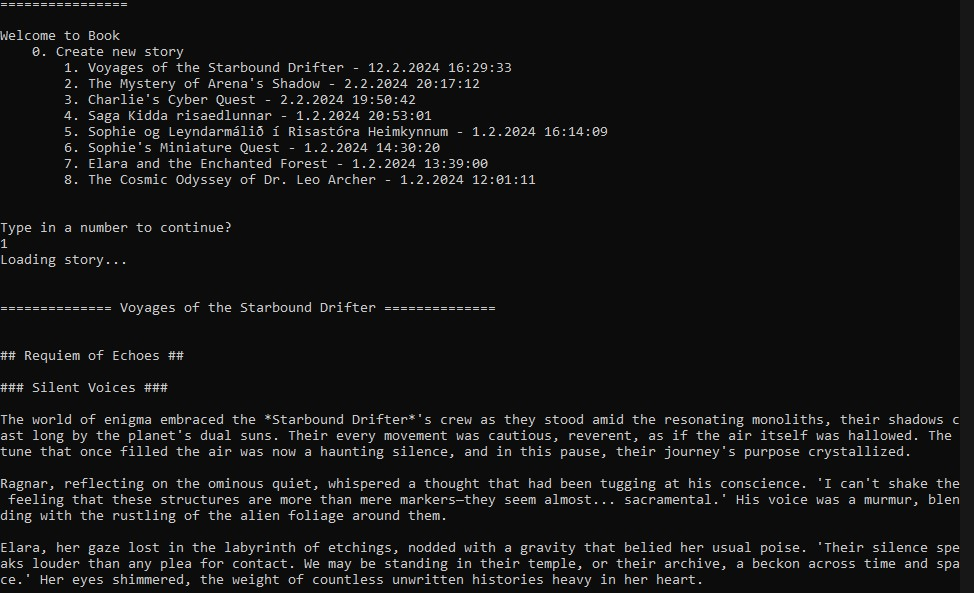

# Book App Documentation

## General Information

Book is an application designed to craft stories based on user input. Users can specify details about the reader, the story's description, and the desired language for the book. The application generates stories that can either continue from the last chapter or start anew, depending on the user's preference. This flexibility allows for a unique storytelling experience tailored to the user's imagination.

## Usage

Upon launching the Book app, users are presented with two options: to create a new story or to browse through existing stories in the database. If a user chooses to explore existing stories, the app displays the most recent chapter of the selected story. Users have the option to generate a new chapter for the ongoing story.

Additionally, users have the freedom to craft their own storylines, setting them in any environment, with any characters, at any time period they choose. This feature enables a personalized storytelling experience, allowing users to explore diverse narratives.

## How to Run

To use the Book app, follow these simple steps:

1. Clone the repository from [PLangHQ's Book app GitHub page](https://github.com/PLangHQ/apps/tree/main/Book).
2. Navigate to the root directory of the Book folder on your local machine.
3. Execute the `plang` command to start the application.

The application will guide you through the process of creating or selecting a story and managing chapters.

## Screenshot

## Flowchart
Since plang is in natural language, it is easy for [LLM to understand](https://chat.openai.com/share/e386766b-68a7-46fb-88fe-672572aeab35) it and draw a flowchart of the application.

