# DraftIdea
Ever had an app idea but didn't know where to start? 

DraftIdea is here to bridge that gap. Provide a detailed description of your app, and DraftIdea will sketch out a basic structure for you. 

It won't be fully functional, but it's a great way to kickstart your development process.

## How to use
1. Clone this repository to your local machine.
2. Open a terminal or command prompt, navigate to the cloned directory, and execute:
```bash
plang
```
3.  Provide as much detail as possible about your app for the best results.

## Summary
This app streamlines the initial phase of app development by automating the generation of boilerplate code based on user-defined criteria. It leverages a machine learning model to interpret the user's requirements and produce relevant starter code, potentially saving time and providing a structured beginning for further development.

## Flow of app

This application is designed to assist users in generating starter code for their app ideas based on a set of questions about the app's requirements. Here's how it works:

Since plang is in natural language, it is easy for [LLM to understand](https://chat.openai.com/share/7065371a-42eb-4041-87a2-3c911df3ffcf) it and draw a flowchart of the application.




### Start
1. **Gather App Requirements**: The application begins by prompting the user to describe the app they want to create, specifically asking whether the app needs database interactions, data fetching from a web service, or decision-making capabilities from the user. The user's responses are saved in a variable `%idea%`.

2. **Read System and Example Files**: The app reads a file named `system.txt` into a variable `%system%`, which likely contains system configurations or predefined settings. It also reads another file, `plangexample.txt`, into `%plangExamples%`, which seems to store examples of plang (a pseudo programming language) code. The `dont load vars` instruction indicates that the app should not interpret variables within the `plangexample.txt` file.

3. **Generate Starter Code**: The application then uses a machine learning model (specified as `gpt-4-0125-preview`) to generate starter code based on the system configurations (`%system%`), plang examples (`%plangExamples%`), and the user's app idea (`%idea%`). The output is structured to provide the app name (`appName`) and the corresponding starter code (`code`).

4. **Write Code to File**: The generated code is saved into a file named after the app (`%appName%.goal`), using the `.goal` extension, which might be specific to the development environment or framework being used.

5. **User Notification**: Finally, the application notifies the user that the starter code has been generated and saved to a file named `%appName%.goal`. It also cautions that the generated code is only a starting point and might contain syntax or logical errors.

