# Hackernews app

This is simple window app for proof of concept. It displays frontpage news from Hackernews and stores it localy.

## How to run
Download the content of this repository to your computer. Open terminal/cmd, navigator to the directory and run the command

```bash
plangw
```

## Summary
This application is a Hacker News client that periodically fetches the latest news items from the Hacker News Algolia API, processes each item to determine if it's new or existing, and then updates the database accordingly. The application ensures that the user always has access to the newest articles without manual intervention.

## Flow explained
Since plang is in natural language, it is easy for [LLM to understand](https://chat.openai.com/share/cfd0c824-1627-4f0f-8f45-4eb240a1d828) it and draw a flowchart of the application.



The following text explains [Start.goal](Start.goal)

### Start
1. **Initialize the Application Window**: The application starts by initializing a window with the title "Hackernews" and a height of 800 pixels. This serves as the main interface for the user.
2. **Initial Data Load**: Upon starting, the application immediately calls the `LoadHackerNews` function to load the initial set of news items.
3. **Continuous Update**: The application is designed to automatically fetch the latest Hacker News items by calling `GetHackerNews` every 10 minutes. This ensures that the content displayed is up-to-date without any manual refresh required from the user.

### LoadHackerNews
1. **Fetch Data from Database**: This function retrieves all items from the `front_page` table in the application's database, ordering them by the newest first. This data is temporarily stored in a variable `%items%`.
2. **Display Items**: After fetching the items, the function calls `!ShowItems` (the `!` denotes a special operation or an external call) to display these items on the application window.

### GetHackerNews
1. **Fetch Data from API**: This function makes an HTTP GET request to the Hacker News Algolia API to fetch the latest items tagged as `front_page`.
2. **Process Each Item**: For each item retrieved (`%items.hits%`), the application calls `ProcessItem`, passing the `front_page` table as a parameter. This suggests that each item is individually processed for insertion or updating in the database.
3. **Refresh Display**: After all items are processed, `!LoadHackerNews` is called again, likely to refresh the display with the updated data from the database.

### ProcessItem
1. **Check for Existing Item**: The function checks if the current item already exists in the `front_page` table by searching for a matching `story_id`.
2. **Insert or Update Item**: 
    - If the item is new (no matching `story_id` found), it calls `!InsertItem` to add the new item to the database and then calls `!UpdateItem` (although it might not be necessary to update immediately after insertion).
    - If the item exists (`%id%` is not empty), it directly calls `!UpdateItem` to update the existing item's details like comments count and points.

### InsertItem
- **Add New Item to Database**: This function inserts a new item into the `front_page` table with details such as `story_id`, `title`, `created_at`, `num_comments`, `url`, `points`, and `author`.

### UpdateItem
- **Update Existing Item in Database**: This function updates an existing item in the `front_page` table, specifically the number of comments (`%item.num_comments%`) and points (`%item.points%`), based on the item's `id`.


----
This documentation was generated by ChapGPT (with 2 small changes)

ChapGPT command:
> Explain the flow in this app. This app is written in plang programming language, a pseudo language. This is for README in git repo. [Content of Start.goal]